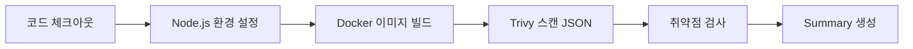

# Trivy 취약점 스캔 워크플로우 가이드

## 📋 목차
1. [개요](#개요)
2. [구현 배경](#구현-배경)
3. [워크플로우 구성](#워크플로우-구성)
4. [두 가지 접근 방식](#두-가지-접근-방식)
5. [상세 구현 내용](#상세-구현-내용)
6. [비용 고려사항](#비용-고려사항)
7. [사용 가이드](#사용-가이드)

---

## 개요

본 프로젝트는 GitHub Actions를 활용하여 Docker 이미지의 보안 취약점을 자동으로 검사하는 CI/CD 파이프라인을 구현합니다. Aqua Security의 Trivy를 사용하여 컨테이너 이미지에 포함된 OS 패키지, 언어 런타임, 애플리케이션 라이브러리의 알려진 취약점(CVE)을 검출합니다.

**주요 기능:**
- 🔍 Docker 이미지 빌드 후 자동 취약점 스캔
- 🚨 CRITICAL/HIGH 등급 취약점 검출 시 빌드 실패
- 📊 두 가지 결과 확인 방식 제공
- 🔗 CVE 데이터베이스 링크 자동 생성

---

## 구현 배경

### 왜 Trivy를 선택했는가?

1. **포괄적인 검사 범위**
   - OS 패키지 (Alpine apk, Debian apt 등)
   - 언어별 패키지 관리자 (npm, pip, gem 등)
   - 애플리케이션 의존성

2. **GitHub Actions 친화적**
   - 공식 GitHub Action 제공 (`aquasecurity/trivy-action`)
   - 간단한 설정으로 즉시 사용 가능
   - 다양한 출력 형식 지원 (JSON, SARIF, Table 등)

3. **무료 오픈소스**
   - 라이선스 비용 없음
   - 활발한 커뮤니티와 지속적인 업데이트

### 왜 두 가지 워크플로우를 만들었는가?

GitHub의 보안 기능은 리포지토리 타입에 따라 접근성이 다릅니다:

| 기능 | Public Repository | Private Repository |
|------|-------------------|-------------------|
| GitHub Security Tab | 무료 | GitHub Advanced Security 필요 (유료) |
| Actions Summary Tab | 무료 | 무료 |

따라서:
- **GHAS 사용 가능**: `test-deploy-ghas.yaml` - Security 탭 활용
- **GHAS 사용 불가**: `test-deploy.yaml` - Summary 탭 활용

---

## 워크플로우 구성

### 공통 단계

두 워크플로우 모두 다음 단계를 공유합니다:



1. **코드 체크아웃**: 리포지토리 코드 가져오기
2. **환경 설정**: Node.js 환경 변수 설정
3. **이미지 빌드**: Dockerfile을 사용한 Docker 이미지 빌드
4. **Trivy 스캔**: 빌드된 이미지 취약점 검사
5. **결과 처리**: 취약점 발견 시 빌드 실패
6. **Summary 생성**: 상세 결과 테이블 생성

---

## 두 가지 접근 방식

### 1️⃣ GitHub Security Tab 활용 방식 (`test-deploy-ghas.yaml`)

**파일 위치**: `.github/workflows/test-deploy-ghas.yaml`

#### 특징
- ✅ GitHub Security Tab에 취약점 표시
- ✅ 시간에 따른 취약점 추세 확인 가능
- ✅ 브랜치별 취약점 현황 조회
- ✅ 자동 알림 및 Dependabot 연동 가능
- ❌ Private 리포지토리는 GHAS 라이선스 필요

#### 추가 단계

**SARIF 형식 출력:**
```yaml
- name: Run Trivy for SARIF output
  if: always()
  uses: aquasecurity/trivy-action@0.33.1
  with:
    image-ref: trivy-test:${{ env.image_tag }}
    format: 'sarif'
    output: 'trivy-results.sarif'
    severity: 'CRITICAL,HIGH'
    ignore-unfixed: true
    exit-code: '0'
```

**Security Tab 업로드:**
```yaml
- name: Upload Trivy results to GitHub Security tab
  uses: github/codeql-action/upload-sarif@v3
  if: always()
  with:
    sarif_file: 'trivy-results.sarif'
```

#### 결과 확인 방법
1. **Security 탭**: `Repository → Security → Code scanning alerts`
2. **Summary 탭**: 워크플로우 실행 페이지
3. **로그**: 간단한 통계 정보

---

### 2️⃣ Summary Tab 중심 방식 (`test-deploy.yaml`)

**파일 위치**: `.github/workflows/test-deploy.yaml`

#### 특징
- ✅ 추가 라이선스 불필요
- ✅ Public/Private 리포지토리 모두 사용 가능
- ✅ 상세한 CVE 정보와 링크 제공
- ✅ 워크플로우 내에서 모든 정보 확인 가능
- ❌ Security Tab 기능 미사용

#### 핵심 구현

**취약점 검사 및 빌드 실패:**
```yaml
- name: Check vulnerabilities and fail if found
  run: |
    VULN_COUNT=$(jq '[.Results[]?.Vulnerabilities[]?] | length' trivy-results.json)
    
    if [ "$VULN_COUNT" -gt 0 ]; then
      CRITICAL_COUNT=$(jq '[.Results[]?.Vulnerabilities[]? | select(.Severity=="CRITICAL")] | length' trivy-results.json)
      HIGH_COUNT=$(jq '[.Results[]?.Vulnerabilities[]? | select(.Severity=="HIGH")] | length' trivy-results.json)
      
      echo "::error title=취약점 발견::$VULN_COUNT개의 보안 취약점이 발견되었습니다"
      echo "❌ 보안 취약점 발견"
      echo "   - CRITICAL: $CRITICAL_COUNT개"
      echo "   - HIGH: $HIGH_COUNT개"
      exit 1
    fi
```

**Summary 테이블 생성:**
```yaml
- name: Generate vulnerability summary
  if: always()
  run: |
    echo "| 심각도 | CVE ID | 패키지 | 설치된 버전 | 수정 버전 | 제목 |" >> $GITHUB_STEP_SUMMARY
    
    jq -r '.Results[]?.Vulnerabilities[]? | [.Severity, .VulnerabilityID, .PkgName, .InstalledVersion, (.FixedVersion // "N/A"), .Title] | @tsv' trivy-results.json | \
    while IFS=$'\t' read -r severity cve pkg installed fixed title; do
      cve_lower=$(echo "$cve" | tr '[:upper:]' '[:lower:]')
      echo "| $severity | [$cve](https://avd.aquasec.com/nvd/$cve_lower) | $pkg | $installed | $fixed | $title |" >> $GITHUB_STEP_SUMMARY
    done
```

#### 결과 확인 방법
1. **로그 (간략)**: 취약점 개수와 심각도별 통계
2. **Summary 탭 (상세)**: CVE ID, 패키지 정보, 수정 버전, 참고 링크

---

## 상세 구현 내용

### 1. 취약점 검사 설정

**검사 대상:**
```yaml
severity: 'CRITICAL,HIGH'  # 치명적/높은 등급만 검사
ignore-unfixed: true       # 패치가 없는 취약점 제외
exit-code: '0'            # Trivy 자체는 실패하지 않음
```

**이유:**
- `CRITICAL`, `HIGH`만 검사: 실질적으로 위험한 취약점에 집중
- `ignore-unfixed: true`: 수정 불가능한 취약점으로 빌드 차단 방지
- `exit-code: '0'`: 커스텀 로직으로 빌드 실패 제어

### 2. 빌드 실패 로직

**취약점 발견 시 동작:**
```bash
if [ "$VULN_COUNT" -gt 0 ]; then
  echo "::error title=취약점 발견::..."  # GitHub Annotation
  echo "❌ 보안 취약점 발견"              # 콘솔 출력
  echo "📊 상세 정보: <링크>"            # Summary 링크
  exit 1                                 # 빌드 실패
fi
```

**장점:**
- 취약점 있는 이미지의 배포 차단
- 개발자에게 즉각적인 피드백
- 보안 정책 강제 적용

### 3. CVE 링크 생성

**구현 상세:**
```bash
cve_lower=$(echo "$cve" | tr '[:upper:]' '[:lower:]')
echo "[$cve](https://avd.aquasec.com/nvd/$cve_lower)"
```

**왜 소문자 변환이 필요한가?**
- Trivy 출력: `CVE-2023-12345` (대문자)
- AVD URL: `cve-2023-12345` (소문자)
- 자동 변환으로 올바른 링크 생성

**링크 선택 이유:**
- `avd.aquasec.com`: Aqua Security의 취약점 데이터베이스
- NVD, GHSA 등 여러 소스 통합
- 상세한 설명과 해결 방법 제공

### 4. Summary 테이블 형식

**출력 예시:**

| 심각도 | CVE ID | 패키지 | 설치된 버전 | 수정 버전 | 제목 |
|--------|--------|--------|-------------|-----------|------|
| CRITICAL | [CVE-2023-12345](https://avd.aquasec.com/nvd/cve-2023-12345) | openssl | 3.1.0 | 3.1.4 | OpenSSL: Remote code execution vulnerability |
| HIGH | [CVE-2023-67890](https://avd.aquasec.com/nvd/cve-2023-67890) | libssl3 | 3.0.8 | 3.0.11 | OpenSSL: Buffer overflow in certificate parsing |

**테이블 구성 이유:**
- **심각도**: 우선순위 파악
- **CVE ID**: 고유 식별자 + 상세 정보 링크
- **패키지**: 취약점 있는 구성요소 식별
- **설치된 버전**: 현재 상태 확인
- **수정 버전**: 업그레이드 목표 버전
- **제목**: 취약점 요약

---

## 비용 고려사항

### GitHub Advanced Security (GHAS)

**가격 (2024년 기준):**
- Public Repository: 무료
- Private Repository: 
  - GitHub Enterprise Cloud: 커미터당 $49/월
  - GitHub Enterprise Server: 별도 견적

**GHAS 포함 기능:**
- Code Scanning (CodeQL)
- Secret Scanning
- Dependency Review
- Security Overview

### 비용 최적화 전략

**시나리오별 권장 사항:**

| 상황 | 권장 워크플로우 | 이유 |
|------|----------------|------|
| Public 리포지토리 | `test-deploy-ghas.yaml` | Security Tab 무료 사용 가능 |
| Private + GHAS 있음 | `test-deploy-ghas.yaml` | 모든 기능 활용 |
| Private + GHAS 없음 | `test-deploy.yaml` | 추가 비용 없이 동일한 보안 검사 |
| 소규모 팀/프로젝트 | `test-deploy.yaml` | 비용 효율적 |

---

## 사용 가이드

### 초기 설정

**1. 워크플로우 파일 선택**

GHAS 사용 가능한 경우:
```bash
cp .github/workflows/test-deploy-ghas.yaml .github/workflows/deploy.yaml
```

GHAS 사용 불가능한 경우:
```bash
cp .github/workflows/test-deploy.yaml .github/workflows/deploy.yaml
```

**2. 트리거 설정**

```yaml
on:
  push:
    branches:
      - main           # main 브랜치 푸시 시 자동 실행
  pull_request:
    branches:
      - main           # PR 생성 시 자동 검사
  workflow_dispatch:   # 수동 실행 가능
```

**3. 권한 설정**

```yaml
permissions:
  contents: read          # 코드 읽기
  security-events: write  # Security Tab 쓰기 (GHAS용)
  pull-requests: write    # PR 코멘트 (옵션)
```

### 결과 확인

**워크플로우 실행 후:**

1. **Actions 탭** → 워크플로우 실행 클릭
2. 실패 시:
   - 로그에서 간단한 통계 확인
   - `Check vulnerabilities and fail if found` 단계 확인
3. **Summary 탭** 클릭
   - 전체 취약점 테이블 확인
   - CVE ID 클릭하여 상세 정보 조회

### 취약점 해결 프로세스

**1. 취약점 발견 시:**
```bash
❌ 보안 취약점 발견
   - CRITICAL: 2개
   - HIGH: 3개
📊 상세 정보: <Summary 링크>
```

**2. Summary 테이블에서 확인:**
- 어떤 패키지가 취약한지
- 현재 버전과 수정 버전
- CVE 링크에서 상세 내용 확인

**3. 해결 방법:**

**베이스 이미지 업데이트:**
```dockerfile
# 변경 전
FROM node:18.12.0-alpine

# 변경 후
FROM node:18.20.0-alpine
```

**패키지 업데이트:**
```dockerfile
RUN apk upgrade --no-cache
```

**애플리케이션 의존성 업데이트:**
```bash
npm update
npm audit fix
```

**4. 재검사:**
- 수정 후 푸시
- 워크플로우 자동 실행
- ✅ 취약점 해결 확인

### 고급 설정

**검사 심각도 조정:**
```yaml
severity: 'CRITICAL,HIGH,MEDIUM'  # MEDIUM 추가
```

**패치 없는 취약점도 검사:**
```yaml
ignore-unfixed: false
```

**추가 스캔 타입:**
```yaml
scan-type: 'image,config,secret'  # 설정, 시크릿도 검사
```

---

## 트러블슈팅

### 일반적인 문제

**1. "No vulnerabilities found"인데 취약점이 있는 것 같아요**
- `ignore-unfixed: true` 설정으로 패치 없는 취약점 제외됨
- `severity` 설정으로 낮은 등급 제외됨
- 설정 조정 필요

**2. 너무 많은 취약점이 발견돼요**
- 오래된 베이스 이미지 사용 확인
- 시스템 패키지 업데이트: `RUN apk upgrade`
- 최신 베이스 이미지로 변경

**3. CVE 링크가 작동하지 않아요**
- GHSA ID는 GitHub Advisory로 연결됨
- 정상 동작이며, 해당 페이지에서 정보 확인 가능

**4. 빌드가 계속 실패해요**
- 긴급한 경우 임시로 `exit-code: '0'` 설정
- 취약점 해결 계획 수립 후 진행

---

## 참고 자료

### 공식 문서
- [Trivy 공식 문서](https://aquasecurity.github.io/trivy/)
- [Trivy GitHub Action](https://github.com/aquasecurity/trivy-action)
- [GitHub Actions 문서](https://docs.github.com/en/actions)
- [SARIF 형식](https://docs.github.com/en/code-security/code-scanning/integrating-with-code-scanning/sarif-support-for-code-scanning)

### 취약점 데이터베이스
- [Aqua Vulnerability Database](https://avd.aquasec.com/)
- [National Vulnerability Database](https://nvd.nist.gov/)
- [GitHub Advisory Database](https://github.com/advisories)

### 관련 도구
- [Docker Scout](https://docs.docker.com/scout/)
- [Snyk](https://snyk.io/)
- [Grype](https://github.com/anchore/grype)

---

## 버전 히스토리

- **v1.0** (2026-01-07): 초기 구현
  - Trivy 기본 스캔 구현
  - 두 가지 워크플로우 방식 개발
  - Summary 테이블 형식 확립
  - CVE 링크 자동 생성

---

## 라이선스

이 문서와 워크플로우 설정은 프로젝트의 라이선스를 따릅니다.

**사용된 오픈소스:**
- Trivy: Apache License 2.0
- GitHub Actions: GitHub Terms of Service

---

## 기여

개선 사항이나 버그 발견 시:
1. Issue 등록
2. Pull Request 제출
3. 문서 업데이트

---

**작성일**: 2026년 1월 7일  
**작성자**: DevOps Team  
**버전**: 1.0
